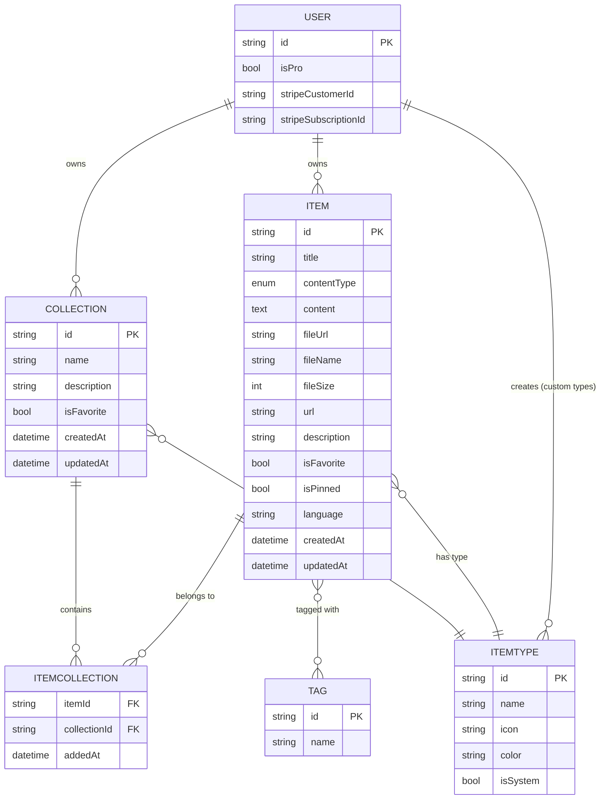

# DevStash — Project Overview

---

## 1. Problem Statement

Developers scatter their working knowledge across too many tools:

| Scattered today | Lives in |
|-----------------|----------|
| Code snippets | VS Code, Notion |
| AI prompts | Chat histories |
| Context files | Random project folders |
| Useful links | Browser bookmarks |
| Docs | Random folders |
| Commands | `.txt` files |
| Project templates | GitHub Gists |
| Terminal one-liners | Bash history |

This fragmentation causes constant context-switching, lost knowledge, and inconsistent workflows.

**DevStash** is a single, fast, searchable, AI-enhanced hub for all developer knowledge and resources.

---

## 2. Target Users

| Persona | Core Need |
|---------|-----------|
| **Everyday Developer** | Fast capture/retrieval of snippets, prompts, commands, links |
| **AI-first Developer** | Organize prompts, contexts, workflows, system messages |
| **Content Creator / Educator** | Store code blocks, explanations, course notes |
| **Full-stack Builder** | Collect patterns, boilerplates, API examples |

---

## 3. Feature Set

### A. Items & Item Types

Items are the atomic unit of DevStash. Every item has a **type**.

- System built-in types **cannot be edited or deleted** by users.
- Users can eventually create **custom types** (Pro, post-launch).
- Each type has a **content model**: `text`, `url`, or `file`.

| Type | Content Model | Tier |
|------|---------------|------|
| Snippet | text | Free |
| Prompt | text | Free |
| Note | text | Free |
| Command | text | Free |
| Link | url | Free |
| File | file | Pro |
| Image | file | Pro |

- Items should be creatable/viewable in a **drawer** (no full page reload/navigation required).
- Route convention for type-scoped views: `/items/[typeSlug]` (e.g. `/items/snippets`).

### B. Collections

- A collection is a user-defined grouping that can hold items of **any type** (mixed types allowed).
- Items support a **many-to-many** relationship with collections (e.g., a React snippet can live in both "React Patterns" and "Interview Prep" collections).
- Examples: `React Patterns` (snippets, notes), `Context Files` (files), `Python Snippets` (snippets).

### C. Search

Unified search across:
- Content body
- Tags
- Titles
- Item type

### D. Authentication

- Email/password
- GitHub OAuth
- via NextAuth v5

### E. Core UX Features

- Favorite items & collections
- Pin items to top
- "Recently used" list
- Import code from a file
- Markdown editor for text-based types
- File upload for `file` / `image` types
- Export data (multiple formats)
- Dark mode (default) / Light mode (optional)
- Add/remove an item to/from multiple collections
- View which collections an item currently belongs to

### F. AI Features (Pro only)

- Auto-tag suggestions
- AI summaries
- "Explain this code"
- Prompt optimizer

---

## 4. Data Model (Draft)

> ⚠️ **Draft — not final.** Field names, types, and relations will evolve as the schema is implemented. Treat this as a starting point for the first migration, not a spec to build against blindly.

### 4.1 Entity Overview



### 4.2 Prisma Schema (Rough Draft)

> ⚠️ Draft only — not tuned for indexes, cascade rules, or Prisma 7 syntax nuances yet. Validate against the latest Prisma 7 docs before running a real migration. **Never run `db push`** — all schema changes go through proper migrations (dev → prod).

```prisma
// schema.prisma — DRAFT, subject to change

model User {
  id                   String   @id @default(cuid())
  // ...NextAuth-required fields (name, email, image, accounts, sessions)

  isPro                Boolean  @default(false)
  stripeCustomerId     String?
  stripeSubscriptionId String?

  items       Item[]
  collections Collection[]
  itemTypes   ItemType[]   // custom types created by this user

  createdAt DateTime @default(now())
  updatedAt DateTime @updatedAt
}

model Item {
  id          String   @id @default(cuid())
  title       String
  contentType ContentType // text | file
  content     String?     @db.Text // null if contentType = file
  fileUrl     String?     // R2 URL, null if contentType = text
  fileName    String?
  fileSize    Int?
  url         String?     // for link-type items
  description String?
  isFavorite  Boolean  @default(false)
  isPinned    Boolean  @default(false)
  language    String?     // optional, for syntax highlighting

  userId String
  user   User   @relation(fields: [userId], references: [id])

  itemTypeId String
  itemType   ItemType @relation(fields: [itemTypeId], references: [id])

  tags        Tag[]
  collections ItemCollection[]

  createdAt DateTime @default(now())
  updatedAt DateTime @updatedAt

  @@index([userId])
  @@index([itemTypeId])
}

model ItemType {
  id       String  @id @default(cuid())
  name     String
  icon     String
  color    String
  isSystem Boolean @default(false)

  userId String? // null for system types
  user   User?   @relation(fields: [userId], references: [id])

  items                Item[]
  collectionsAsDefault Collection[]

  @@unique([userId, name])
}

model Collection {
  id          String  @id @default(cuid())
  name        String
  description String?
  isFavorite  Boolean @default(false)

  userId String
  user   User   @relation(fields: [userId], references: [id])

  defaultTypeId String?
  defaultType   ItemType? @relation(fields: [defaultTypeId], references: [id])

  items ItemCollection[]

  createdAt DateTime @default(now())
  updatedAt DateTime @updatedAt

  @@index([userId])
}

model ItemCollection {
  itemId       String
  collectionId String
  addedAt      DateTime @default(now())

  item       Item       @relation(fields: [itemId], references: [id], onDelete: Cascade)
  collection Collection @relation(fields: [collectionId], references: [id], onDelete: Cascade)

  @@id([itemId, collectionId])
}

model Tag {
  id    String @id @default(cuid())
  name  String @unique
  items Item[]
}

enum ContentType {
  text
  url
  file
}
```

---

## 5. Tech Stack

| Layer | Choice |
|-------|--------|
| Framework | Next.js 16 / React 19 (SSR pages + dynamic components) |
| Backend | Next.js API routes (items, file uploads, AI calls) |
| Language | TypeScript |
| Database | Neon (PostgreSQL, serverless) |
| ORM | Prisma 7 *(fetch latest docs — API has changed across major versions)* |
| Caching | Redis — **maybe**, not committed |
| File Storage | Cloudflare R2 |
| Auth | NextAuth v5 (email/password + GitHub OAuth) |
| AI | OpenAI `gpt-5-nano` |
| Styling | Tailwind CSS v4 + shadcn/ui |
| Repo Structure | Single codebase/repo |

**Hard rule:** never use `prisma db push` or manual schema edits against the live database. All changes go through migrations, run in dev first, then promoted to prod.

---

## 6. Monetization

### Free Tier
- 50 items total
- 3 collections
- All system types **except** File / Image
- Basic search
- No file/image uploads
- No AI features

### Pro Tier — $8/mo or $72/yr
- Unlimited items
- Unlimited collections
- File & image uploads
- Custom types *(post-launch)*
- AI auto-tagging
- AI code explanation
- AI prompt optimizer
- Data export (JSON/ZIP)
- Priority support

> **Dev-mode note:** Build the `isPro` gating logic now so it's wired up correctly, but during development leave all features unlocked for every user (bypass the paywall checks, don't remove them).

---

## 7. UI / UX

### Visual Direction
- Modern, minimal, developer-focused
- Dark mode by default; light mode optional
- Clean typography, generous whitespace
- Subtle borders/shadows
- Inspiration: **Notion**, **Linear**, **Raycast**
- Syntax highlighting on all code blocks

### Layout
- **Sidebar** (collapsible): item type shortcuts (Snippets, Commands, etc.), recent collections
- **Main area**: grid of collection cards, background-tinted by the dominant item type they hold; items nested inside color-coded (border) cards by type
- **Item detail**: opens in a quick-access drawer, not a full page navigation

### Responsive Behavior
- Desktop-first, mobile-usable
- Sidebar collapses into a drawer on mobile

### Micro-interactions
- Smooth transitions
- Hover states on cards
- Toast notifications for actions
- Loading skeletons (not spinners) for perceived performance

### Screenshots
See those screenshots for the main dashboard design. It does not have to be pixel perfect. Use it as a reference.
`@public/screenshots/dashboard-ui-main.png`
`@public/screenshots/dashboard-ui-drawer.png`

---

## 8. Type Reference — Colors & Icons

Uses [Lucide icons](https://lucide.dev) (pairs naturally with shadcn/ui).

| Type | Color | Hex | Icon (lucide-react) |
|------|-------|-----|---------------------|
| Snippet | 🔵 Blue | `#3b82f6` | `Code` |
| Prompt | 🟣 Purple | `#8b5cf6` | `Sparkles` |
| Command | 🟠 Orange | `#f97316` | `Terminal` |
| Note | 🟡 Yellow | `#fde047` | `StickyNote` |
| File | ⚪ Gray | `#6b7280` | `File` |
| Image | 🌸 Pink | `#ec4899` | `Image` |
| Link | 🟢 Emerald | `#10b981` | `Link` |

---

## 9. Reference Links

| Resource | URL |
|----------|-----|
| Next.js Docs | https://nextjs.org/docs |
| Prisma Docs | https://www.prisma.io/docs |
| Neon | https://neon.tech/docs |
| Cloudflare R2 | https://developers.cloudflare.com/r2 |
| NextAuth v5 (Auth.js) | https://authjs.dev |
| Tailwind CSS v4 | https://tailwindcss.com/docs |
| shadcn/ui | https://ui.shadcn.com |
| Lucide Icons | https://lucide.dev |
| OpenAI API Docs | https://platform.openai.com/docs |
| Stripe (for isPro billing) | https://stripe.com/docs |

---

## 10. Open Questions / Risks

- **Tagging scope** — global tags vs. per-user tags (collision risk as drafted).
- **Search strategy** — Postgres full-text search vs. embeddings/vector search for AI-assisted retrieval later.
- **File size limits** — need explicit caps for Pro file/image uploads (R2 storage cost control).
- **Custom types (Pro)** — deferred post-launch; will need UI for icon/color picking and validation against system type name collisions.
- **Redis caching** — not yet committed; revisit once real usage patterns (search load, drawer open latency) are known.
- **Rate limiting AI calls** — needed to control `gpt-5-nano` cost exposure, especially for Free-tier trial/testing periods if any are offered.
